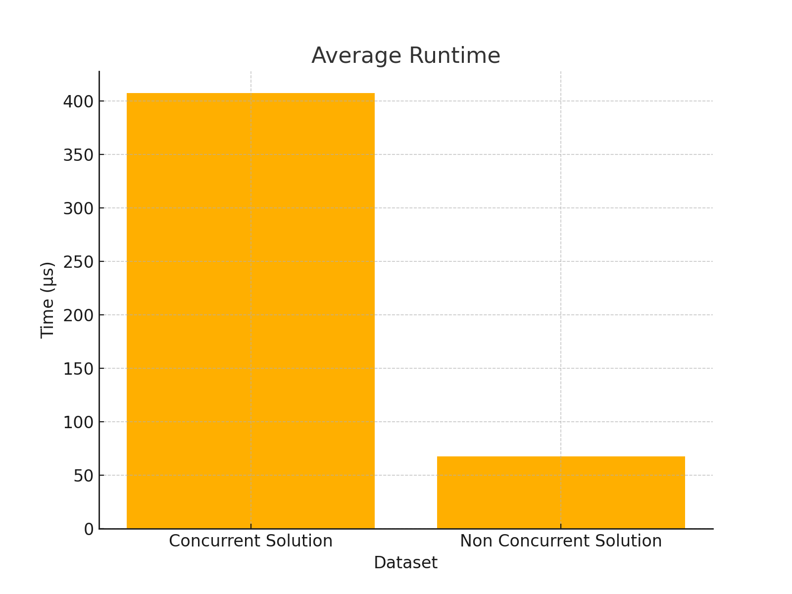
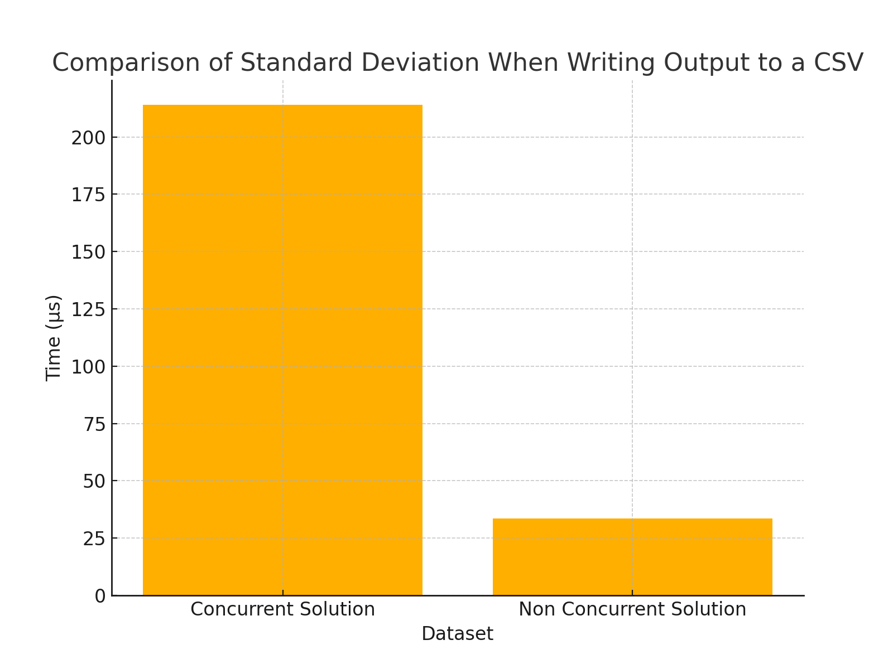

Areas where the program can be improved
* Concurrency and asynchronous programming can be used to improve the performance of the code, however, these
  changes need to be handled cautiously and yield tangibly improved results and cannot be done just for the sake of
  saying we're using concurrency. Below is an example of a result obtained after modifying the way the program writes
  the output to the csv, using Rayon to open parallel threads to write from a vector to the csv file.

````
pub fn write_clients_to_csv(client_map: &DashMap<u16, Client>) -> Result<(), Box<dyn Error>> {
     let start_time = Instant::now();
     let clients: Vec<_> = client_map.iter().collect();
     let mut writer = Writer::from_writer(io::stdout());
     writer.write_record(&["client", "available", "held", "total", "locked"])?;

     let formatted_rows: Vec<Vec<String>> = clients
         .par_iter()
         .map(|client_entry| {
             let client = client_entry.value();
             vec![
                 client.id().to_string(),
                 format!("{:.4}", client.available()),
                 format!("{:.4}", client.held()),
                 format!("{:.4}", client.total()),
                 client.locked().to_string(),
             ]
         })
         .collect();

     for row in formatted_rows {
         writer.write_record(&row)?;
     }
````

Despite using concurrency to chunk the rows and write to the csv, the results are 602% slower on average with a runtime of
407.25 µs while the original solution had an average runtime of 67.65 µs. using a simple iterator to write to the file 
sequentially. A major factor in this downgrade in performance is the need to transfer the data from the dashmap into a 
vector which takes O(n) runtime where n is the number of entries in the dashmap. This level of overhead can be costly.
In addition to an overall slower runtime, the performance of the multithreaded solution varies greatly relative to the 
performance of the original solution as reflected in the standard deviation.

>🤓 The standard deviation is a measure of the spread of a dataset. It indicates how much individual data 
points differ, on average, from the mean of the dataset. A low standard deviation means the data points are close to the
mean, while a high standard deviation indicates that the data points are spread out over a wider range.

The standard deviation of the concurrent solution was 214.00 µs, while the original solution yielded a standard deviation
of 33.55µs. The higher standard deviation of concurrent solution could result in a less consistent experiece for the end\
user.





> ✍️ The datasets used in this test had a total of 50 transaction, and each solution was run a total of ten times. For \
> more concrete results, larger sample sizes and more runs should be used to determine if there is an inflection point 
> where parallism outperforms a single threaded operation for writing to a csv.